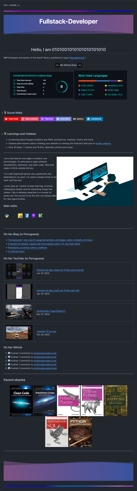
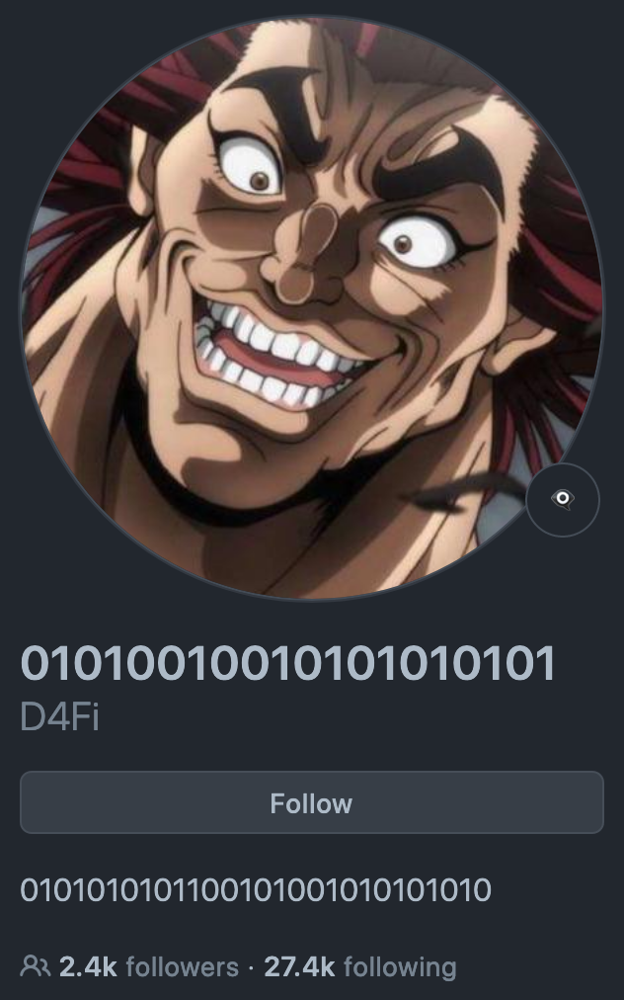

<div align="center">

## Profile README Demo.
</div>

[//]: # ( Screenshot Demo ⬇️ )
<div align="center">
<a href="https://Github.com/Eymeen#README">

</a>
</div>

<div align="center">

## Source Code:
</div>

[//]: # ( README.md Source Code ⬇️ )
```html
<!-- RAINBOW LINE BOT -->


</div>
<h1 align='center'> Hello, I am 0101001010101010101010 </h1>
### Developer and author of the AutoFi library, published on pypi https://pypi.org !!


<h4 align="center">
     My Github Stats 
</h4>

<div align="center">
    
    
</div>
<br>
<br>
<summary>
    <h3> 📚 Social Midia</h3>
</summary>
<div>
    <a href="httdw.youtube.com/channel/UC_-uuuZbY0AAt9CViNzvc-Q" target="_blank"></a>
    <a href="httpdinstagram.com/rafaballerini" target="_blank"></a>
    <a href="dww.twitch.tv/rafaballerinii" target="_blank"></a>
    <a href="httpsd.gg/wagxzStdcR" target="_blank"></a>
    <a href = "maidafaballerini@gmail.com"></a>
    <a href="htddkedin.com/in/rafaella-ballerini-45875016a" target="_blank"></a>
</div>
<br>
<br
    
<summary>
    <h3> 📚 Learnings and Hobbies </h3>
</summary>

* I'm learning about Google Analytics and AWS, architetures, modules, Flutter and more;
* I shared some lessons about creating your website or meeting the Android's lifecycle on [studio urbanna](https://studiourbanna.github.io);
* I love 🥤 Soda, 🎮 Games and 🎭 Arts. Specially, photos and music.

<hr>


I am a fast learner and eager to explore new technologies. An advocate of agile software development, teamwork, and clean code. Able and ready to think outside the box.

I'm a well organized person very passionate and dedicated to my work. I'm used to always finish to my work until the end.

I never give up. I prefer to keep learning, continue challenging myself, and do interesting things that matter. I like to develop expertise in a number of areas over the course of my life and I am always open for new opportunities.


### Main skills:
<div style="display:inline_block"><br>
    
    
    
    
    
    
</div><br>

<br>

<hr>


### On Her Blog (in Portuguese)
<!-- BLOG:START -->
- [“Conversando” com uma IA: perguntei ao Bard, do Google, sobre o trabalho do futuro](https://camilaloliveira.com.br/blog/milla/conversando-com-uma-ia-perguntei-ao-bard-do-google-sobre-o-trabalho-do-futuro/)
- [O desafio do debate: a guerra de informações sobre o PL das Fake News](https://camilaloliveira.com.br/blog/milla/o-desafio-do-debate-a-guerra-de-informacoes-sobre-o-pl-das-fake-news/)
- [Precisamos conversar sobre a violência](https://prensa.li/@clcmo/precisamos-conversar-sobre-a-violencia)
- [E o Mundo Caiu?](https://prensa.li/@clcmo/e-o-mundo-caiu)
<!-- BLOG:END -->

### On Her YouTube (in Portuguese)
<!-- YOUTUBE:START --><table><tr><td width="250px"><a href="https://www.youtube.com/watch?v=LMZ6nu2wDXk"></a></td>
    <td width="800px"><a href="https://www.youtube.com/watch?v=LMZ6nu2wDXk">Exemplo de App criado em Flutter para Android</a><br/>Jan 19, 2023</td></tr></table>
<table><tr><td width="250px"><a href="https://www.youtube.com/watch?v=mPbHteaCD6o"></a></td>
    <td width="800px"><a href="https://www.youtube.com/watch?v=mPbHteaCD6o">Exemplo de App criado em Flutter para iOS</a><br/>Jan 19, 2023</td></tr></table>
<table><tr><td width="250px"><a href="https://www.youtube.com/watch?v=gGDdalEaHVU"></a></td>
    <td width="800px"><a href="https://www.youtube.com/watch?v=gGDdalEaHVU">Conhecendo o jogo Destiny 2</a><br/>Dec 27, 2022</td></tr></table>
<table><tr><td width="250px"><a href="https://www.youtube.com/watch?v=_qQlRJ88-Do"></a></td>
    <td width="800px"><a href="https://www.youtube.com/watch?v=_qQlRJ88-Do">Jogando GT ao vivo</a><br/>Oct 26, 2022</td></tr></table>
<!-- YOUTUBE:END -->

### On Her GitHub
<!--RECENT_ACTIVITY:start-->
1. ⬆️ Pushed 1 commit(s) to [studiourbanna/encurtai](https://github.com/studiourbanna/encurtai)<br>
2. ⬆️ Pushed 1 commit(s) to [studiourbanna/encurtai](https://github.com/studiourbanna/encurtai)<br>
3. ⬆️ Pushed 1 commit(s) to [studiourbanna/encurtai](https://github.com/studiourbanna/encurtai)<br>
4. ⬆️ Pushed 1 commit(s) to [studiourbanna/encurtai](https://github.com/studiourbanna/encurtai)<br>
5. ⬆️ Pushed 2 commit(s) to [studiourbanna/encurtai](https://github.com/studiourbanna/encurtai)<br>
<!--RECENT_ACTIVITY:end-->


<hr>

## Favorit ebooks
<div align="center">
    
    
    
    
    

    
    
</div>

<hr>


<!-- RAINBOW LINE BOT -->


```

<div align="center">

## Created by: Eymen
</div>

[//]: # ( Creator Profile ⬇️)
<div align="center">
<a href="https://Github.com/D4Fi#README">

</a>
</div>

