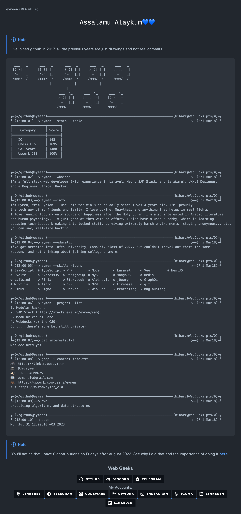
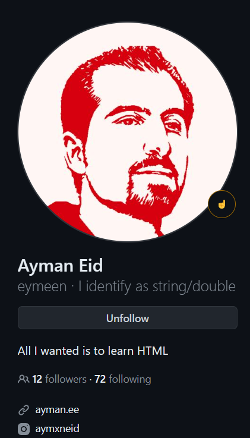

<div align="center">

## Profile README Demo.
</div>

[//]: # ( Screenshot Demo ⬇️ )
<div align="center">
<a href="https://Github.com/Eymeen#README">

</a>
</div>

<div align="center">

## Source Code:
</div>

[//]: # ( README.md Source Code ⬇️ )
```html
  ___   _      ___   _      ___   _      ___   _      ___   _
 [(_)] |=|    [(_)] |=|    [(_)] |=|    [(_)] |=|    [(_)] |=|
  '-`  |_|     '-`  |_|     '-`  |_|     '-`  |_|     '-`  |_|
 /mmm/  /     /mmm/  /     /mmm/  /     /mmm/  /     /mmm/  /
       |____________|____________|____________|____________|
                             |            |            |
                         ___  \_      ___  \_      ___  \_
                        [(_)] |=|    [(_)] |=|    [(_)] |=|
                         '-`  |_|     '-`  |_|     '-`  |_|
                        /mmm/        /mmm/        /mmm/
 
┌─(~/github@eymeen)─────────────────────────────────────────────────────────────────(bibarz@WebDucks:pts/0)─┐
└─(12:00:01)──○ eymen --stats --table                                                        ○──(Fri,Mar18)─┘
╔═════════════════╦═══════╗
║    Category     ║ Score ║
╠═════════════════╬═══════╣
║   IQ            ║ 148   ║
║   Chess Elo     ║ 1695  ║
║   SAT Score     ║ 1480  ║
║   Upwork JSS    ║ 100%  ║
╚═════════════════╩═══════╝


┌─(~/github@eymeen)─────────────────────────────────────────────────────────────────(bibarz@WebDucks:pts/0)─┐
└─(12:00:02)──○ eymen --whoishe                                                              ○──(Fri,Mar18)─┘
I'm a full stack web developer (with experience in Laravel, Mevn, SAM Stack, and laraWare), UX/UI Designer,
and a Beginner Ethical Hacker.

┌─(~/github@eymeen)─────────────────────────────────────────────────────────────────(bibarz@WebDucks:pts/0)─┐
└─(12:00:03)──○ eymen --info                                                                 ○──(Fri,Mar18)─┘
I'm Eymen, from Syrian, I use Computer min 8 hours daily since I was 4 years old, I'm -proudly-
the tech guy of my friends and family. I love boxing, Muaythai, and anything that helps in real fights.
I love running too, my only source of happiness after the Holy Quran. I'm also interested in Arabic literature
and human psychology, I'm just good at them with no effort. I also have a unique hobby, which is learning
escaping techniques, breaking into locked stuff, surviving extremely harsh environments, staying anonymous... etc,
you can say, real-life hacking.

┌─(~/github@eymeen)─────────────────────────────────────────────────────────────────(bibarz@WebDucks:pts/0)─┐
└─(12:00:04)──○ eymen --education                                                            ○──(Fri,Mar18)─┘
I've got accepted into Tufts University, CompSci, class of 2027. But couldn't travel out there for some
reasons, and not thinking about joining college anymore.

┌─(~/github@eymeen)─────────────────────────────────────────────────────────────────(bibarz@WebDucks:pts/0)─┐
└─(12:00:05)──○ eymen --skills -icons                                                        ○──(Fri,Mar18)─┘
⚙ JavaScript  ⚙ TypeScript ⚙ PHP        ⚙ Node       ⚙ Laravel     ⚙ Vue         ⚙ NestJS
⚙ Svelte      ⚙ ExpressJS  ⚙ PostgreSQL ⚙ MySQL      ⚙ MongoDB     ⚙ Redis
⚙ tailwind    ⚙ Pinia      ⚙ Storybook  ⚙ Alpine.js  ⚙ jQuery      ⚙ GraphQL
⚙ Nuxt.js     ⚙ Astro      ⚙ gRPC       ⚙ NPM        ⚙ Firebase    ⚙ git
⚙ Linux       ⚙ Figma      ⚙ Docker     ✦ Web Sec    ✦ Pentesting  ✦ bug hunting 

┌─(~/github@eymeen)─────────────────────────────────────────────────────────────────(bibarz@WebDucks:pts/0)─┐
└─(12:00:06)──○ eymen --project -list                                                        ○──(Fri,Mar18)─┘
1. Modular Backend
2. SAM Stack (https://stackshare.io/eymen/sam).
3. Modular Visual Panel
4. Webducks (or the CJO)
5. ... (there's more but still private)

┌─(~/github@eymeen)─────────────────────────────────────────────────────────────────(bibarz@WebDucks:pts/0)─┐
└─(12:00:07)──○ cat interests.txt                                                            ○──(Fri,Mar18)─┘
Not declared yet
 
┌─(~/github@eymeen)─────────────────────────────────────────────────────────────────(bibarz@WebDucks:pts/0)─┐
└─(12:00:08)──○ grep -i contact info.txt                                                     ○──(Fri,Mar18)─┘
🔗: https://linktr.ee/eymeen
📷: @deveymen
🤙🏻: +905384600675
📧: eymeneid@gmail.com
💼: https://upwork.com/users/eymen
𝕏 : https://x.com/eymen_eid

┌─(~/github@eymeen)─────────────────────────────────────────────────────────────────(bibarz@WebDucks:pts/0)─┐
└─(12:00:09)──○ pwd                                                                          ○──(Fri,Mar18)─┘
practicing algorithms and data structures

┌─(~/github@eymeen)─────────────────────────────────────────────────────────────────(bibarz@WebDucks:pts/0)─┐
└─(12:00:10)──○ date                                                                         ○──(Fri,Mar18)─┘
Mon Jul 31 12:00:10 +03 2023
                                        
```

<div align="center">

## Created by: Eymen
</div>

[//]: # ( Creator Profile ⬇️)
<div align="center">
<a href="https://Github.com/Eymeen#README">

</a>
</div>

