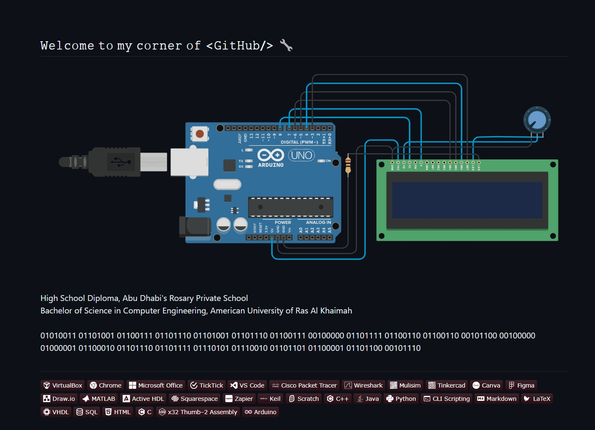
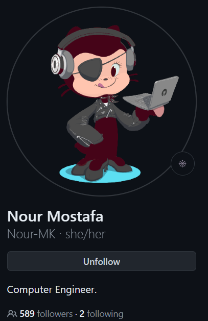

<div align="center">

## Profile README Demo.
</div>

[//]: # ( Screenshot Demo ⬇️ )
<div align="center">
<a href="https://Github.com/NourMostafa#README">

</a>
</div>

<div align="center">

## Source Code:
</div>

[//]: # ( README.md Source Code ⬇️ )
```html


## 𝚆𝚎𝚕𝚌𝚘𝚖𝚎 𝚝𝚘 𝚖𝚢 𝚌𝚘𝚛𝚗𝚎𝚛 𝚘𝚏 \<𝙶𝚒𝚝𝙷𝚞𝚋/\> 🔧


<br>
High School Diploma, Abu Dhabi's Rosary Private School <br>
Bachelor of Science in Computer Engineering, American University of Ras Al Khaimah
<br><br>
01010011 01101001 01100111 01101110 01101001 01101110 01100111 00100000 01101111 01100110 01100110 00101100 00100000 01000001 01100010 01101110 01101111 01110101 01110010 01101101 01100001 01101100 00101110

#


```

<div align="center">

## Created by: Nour-MK
</div>

[//]: # ( Creator Profile ⬇️)
<div align="center">
<a href="https://Github.com/Nour-MK#README">

</a>
</div>
