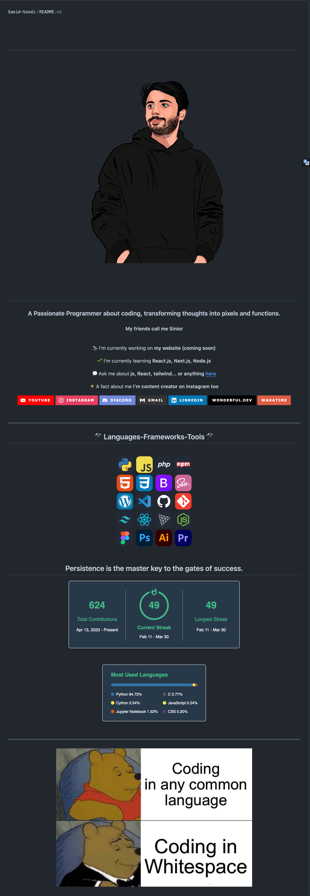
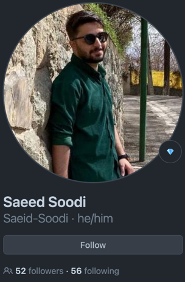

<div align="center">

## Profile README Demo.
</div>

[//]: # ( Screenshot Demo ⬇️ )
<div align="center">
<a href="https://Github.com/Saeid-Soodi#README">

</a>
</div>

<div align="center">

## Source Code:
</div>

[//]: # ( README.md Source Code ⬇️ )
```html

<h1 align="center">
  
</h1>
<p align="center">
  </img>
</p>

<h1 align="center">
  
</h1>

<h3 align="center">A Passionate Programmer about coding, transforming thoughts into pixels and functions.</h3>
<h4 align="center">My friends call me Sinior </h4>
<br/>

<div align="center">
  
  🔭 I’m currently working on **my website (coming soon)**
  
  🌱 I’m currently learning **React.js, Next.js, Node.js**
  
  💬 Ask me about **js, React, tailwind... or anything [here](https://github.com/Saeid-Soodi/Saeid-Soodi/issues)**
  
  ⚡ A fact about me **i'm content creator on Instagram too**
  
  <div align="center">
    <a href="https://www.youtube.com/channel/UC5hiVVN2lvZV4RSsewf82Gw" target="_blank"></a>
    <a href="https://instagram.com/saeed_soodi" target="_blank"></a>
    <a href="https://discord.gg/mVCD3Rzdc8" target="_blank"></a>
    <a href = "mailto:saeid.soodi@gmail.com"></a>
    <a href="" target="_blank"></a>
    
    <a href ="https://wonderful.dev/saeedsoodi" target="_blank">
      </a>
    
    <a href ="https://wakatime.com/@018da999-df4c-4fff-971b-06cddf39324c" target="_blank">
      </a>
    
    <a href=""></a>
  
  
  
  
  </div>
  <hr/>
  
  <h2 align="center">⚒️ Languages-Frameworks-Tools ⚒️</h2>
  <br/>
  <div align="center">
    <br>
    <br>
    <br>
    <br>
    <br>
  
  </div>
  <div>
    <br>
    <h2 align="center"> Persistence is the master key to the gates of success.</h2>
    
    <br/><br/><br/>
    <br/>
    <br/>
    <hr/>
    
  
  </div>


```

<div align="center">

## Created by: Saeid-Soodi
</div>

[//]: # ( Creator Profile ⬇️)
<div align="center">
<a href="https://Github.com/Saeid-Soodi#README">

</a>
</div>

