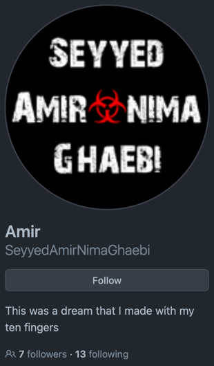

<div align="center">

## Profile README Demo.
</div>

[//]: # ( Screenshot Demo ⬇️ )
<div align="center">
<a href="https://Github.com/SeyyedAmirNimaGhaebi#README">

</a>
</div>

<div align="center">

## Source Code:
</div>

[//]: # ( README.md Source Code ⬇️ )
```html
<h1 align="center"> Hey! Nice to see you.</h1>


<p align="center">I started programming when I was 12 years old and now I work with the advanced Flutter framework</p>


<h2 align="center">Connect with me:</h2>

<div align="center">
    <a href="https://t.me/Amir_gh_dev"></a>
    <a href="https://www.youtube.com/channel/UC_kZNtkh55fPCCUAcM4ABmg"></a></a>
    <a href="https://www.instagram.com/amirgh_888/#">
        <a href="https://s8.uupload.ir/files/untitled_y017.png">
            <a href="">
                
</div>


<h2 align="center">My Current Tech Stack 🚀</h2>

<h3 align="center">Skills + Tools</h3>

<div align="center">
    
    
    
    
    
    
    
    
    
    
    
    
    
    
</div>


<h3 align="center">Plan To Learn</h3>
<div align="center">
    
    
    
</div>


<h2 align="center">👇Don’t forget to follow my channels👇</h2>

<div align="center">
    <a href="https://t.me/dev_music_channel"></a>
    <a href="https://www.youtube.com/channel/UC_kZNtkh55fPCCUAcM4ABmg"></a>
    <a href="https://www.instagram.com/fluttershop.dev?igsh=MWV6NXc1MzY1dmd1"></a>
</div>


<h2>How did I get to know programming?</h2>

<p align="left">Hello, my name is Seyyed Amir Nima Ghaebi.

    I am from the city of Zanjan. I was interested in electronics since I was a child. I wanted to learn and make more things. My cousin taught me about electronics and I progressed so much that I reached the programming section of Arduino boards and from there I fell in love with programming.

    I started learning programming at the age of 12. I first learned C# language and despite all the difficulties I was able to become a professional in it, and with many courses I bought from sites like Faradars, I learned more difficult things, but with a good C# language. I couldn't achieve my goals in programming, so after a lot of searching and consulting with experienced programmers, I got to know the Flutter framework. At first, I watched a few courses of it on YouTube and saw that it had a lot of what I wanted, and finally the Flutter framework. I chose and started learning this powerful and cool framework.
    The Flutter framework was what I wanted, it had the same widgets, the same features that I wanted, I could write the apps I wanted with it.
    When I learned Flutter up to the advanced chapters, I met the Flutter programming groups on Telegram. There, I could easily solve the errors I had in my project with their help, and they helped me a lot.

    Besides programming, I also have other small skills such as working with Word and PowerPoint software, typing.

    I am happy to help you.

    You can see below the certificate of completion of the courses that I took in the Flutter courses and the examples of work that I have done so far.


    ---
    I think these code repositories are okay...

<div align="center">
    <table>
        <tbody>
        <tr>
            <td>
                <a href="https://github.com/SeyyedAmirNimaGhaebi/Flutter130">
                    
                </a>
            </td>
            <td>
                <a href="https://github.com/SeyyedAmirNimaGhaebi/DataBase_hive_in_flutter">
                    
                </a>
            </td>
            <td>
                <a href="https://github.com/SeyyedAmirNimaGhaebi/pub_news">
                    
                </a>
            </td>
        </tr>
        </tbody>
    </table>
</div>

---

# 📊 GitHub Stats:

<p align="center">
    
</p>

<p align="center">
    
    
</p>

<p align="center">

    
</p>


---

# 📕 Articles :

<a href="https://github.com/SeyyedAmirNimaGhaebi/DataBase_hive_in_flutter">Download and read the article</a>

---
# 🖥 My best portfolios :


<a href="https://github.com/SeyyedAmirNimaGhaebi/BMI-Project">👁 More details about the project</a>


---


<a href="https://github.com/SeyyedAmirNimaGhaebi/Login-and-Signup-Ui">👁 More details about the project</a>

<div align="center">
    <a href="https://github.com/SeyyedAmirNimaGhaebi/My-best-portfolios"></a>
</div>

---


# 🧾 Certificate of achievement :


<a href="https://github.com/SeyyedAmirNimaGhaebi/Certificate-of-achievement">View all certificates of success >›</a>

<h1 align="center">🏆 GitHub Trophies</h1>


<!-- Proudly created with GPRM ( https://gprm.itsvg.in ) -->

---
[](https://visitcount.itsvg.in)


```

<div align="center">

## Created by: SeyyedAmirNimaGhaebi
</div>

[//]: # ( Creator Profile ⬇️)
<div align="center">
<a href="https://Github.com/SeyyedAmirNimaGhaebi#README">

</a>
</div>

