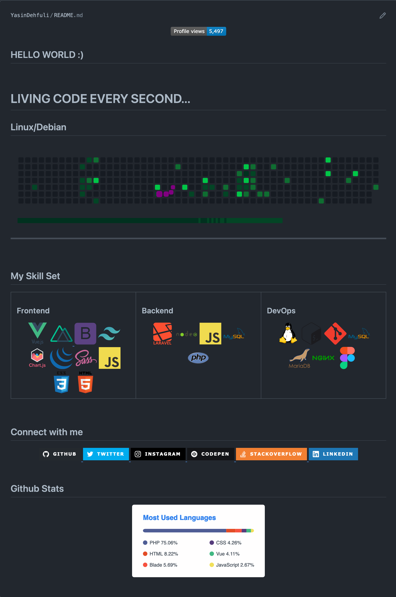
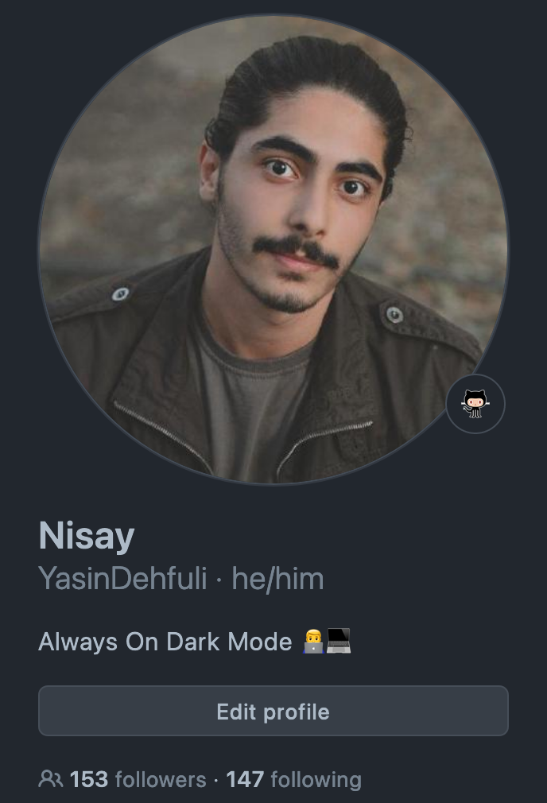

<div align="center">

## Profile README Demo.
</div>

[//]: # ( Screenshot Demo ⬇️ )
<div align="center">
<a href="https://Github.com/YasinDehfuli#README">

</a>
</div>

<div align="center">

## Source Code:
</div>

[//]: # ( README.md Source Code ⬇️ )
```html
<div align="center">


</div>

<h2 >HELLO WORLD :)</h2>
<br>

<h1> LIVING CODE EVERY SECOND...</h1>
<h2> Linux/Debian </h2>

<div align="center"></div>

<hr>  
<br/>

## My Skill Set
<table><tr><td valign="top" width="33%">

### Frontend
<div align="center">  
<a href="https://vuejs.org/" target="_blank"></a> 
<a href="https://nuxtjs.org/" target="_blank" rel="noreferrer">  </a>
<a href="https://getbootstrap.com/docs/3.4/javascript/" target="_blank"></a>  
<a href="https://tailwindcss.com/" target="_blank" rel="noreferrer">  </a>
<a href="https://www.chartjs.org/" target="_blank"></a>  
<a href="https://jquery.com/" target="_blank"></a> 
<a href="https://sass-lang.com/" target="_blank"></a>    
<a href="https://www.javascript.com/" target="_blank"></a>  
<a href="https://www.w3schools.com/css/" target="_blank"></a>  
<a href="https://en.wikipedia.org/wiki/HTML5" target="_blank"></a>   

</div>

</td><td valign="top" width="33%">

### Backend
<div align="center">  
<a href="https://laravel.com/" target="_blank"></a>    
<a href="https://nodejs.org/" target="_blank"></a>  
<a href="https://www.javascript.com/" target="_blank"></a>
<a href="https://www.mysql.com/" target="_blank"></a>  
<a href="https://www.php.net/" target="_blank"></a>  

</div>

</td><td valign="top" width="33%">

### DevOps
<div align="center">  
<a href="https://www.linux.org/" target="_blank"></a>  
<a href="https://www.gnu.org/software/bash/" target="_blank"></a>  
<a href="https://github.com/" target="_blank"></a>  
<a href="https://www.mysql.com/" target="_blank"></a>  
<a href="https://mariadb.org/" target="_blank"></a>  
<a href="https://www.nginx.com/" target="_blank"></a>  
<a href="https://www.figma.com/" target="_blank"></a>   

</div>

</td></tr></table>  

<br/>

## Connect with me
<div align="center">
<a href="https://github.com/YasinDehfuli" target="_blank">

</a>
<a href="https://twitter.com/YasinDehfuli" target="_blank">

</a>
<a href="https://instagram.com/i.ycn" target="_blank">

</a>
<a href="https://codepen.com/YasinDehfuli" target="_blank">

</a>
<a href="https://stackoverflow.com/users/19177904/yasin-dehfuli" target="_blank">

</a>
<a href="https://www.linkedin.com/in/yasin-dehfuli/" target="_blank">

</a>  
</div>

<br/>

## Github Stats
<div align="center"></div>  

<br/>
```

<div align="center">

## Created by: Yasin
</div>

[//]: # ( Creator Profile ⬇️)
<div align="center">
<a href="https://Github.com/YasinDehfuli#README">

</a>
</div>

