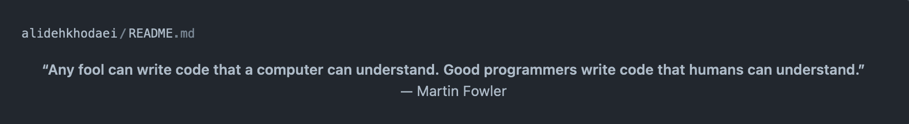

<div align="center">

## Profile README Demo.
</div>

[//]: # ( Screenshot Demo ⬇️ )
<div align="center">
<a href="https://Github.com/alidehkhodaei#README">

</a>
</div>

<div align="center">

## Source Code:
</div>

[//]: # ( README.md Source Code ⬇️ )
```html
<p align="center"><b>“Any fool can write code that a computer can understand. Good programmers write code that humans can understand.”</b><br/>— Martin Fowler</p>
```

<div align="center">

## Created by: smart-person
</div>

[//]: # ( Creator Profile ⬇️)
<div align="center">
<a href="https://Github.com/alidehkhodaei#README">

</a>
</div>

