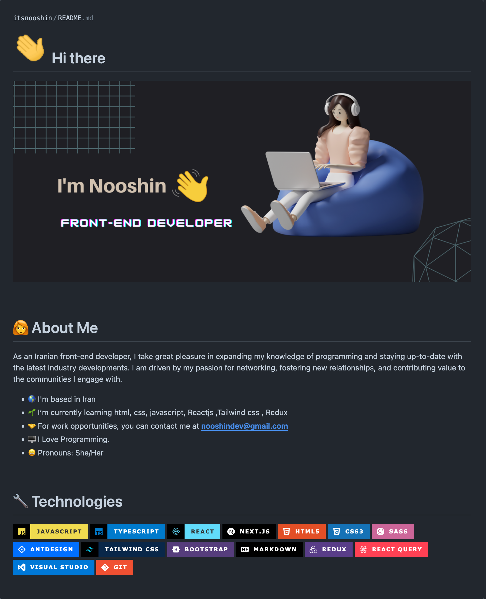
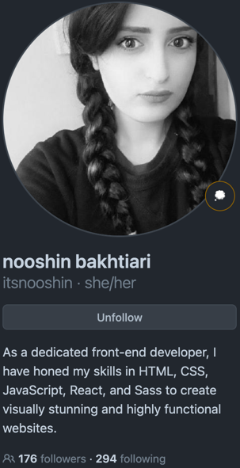

<div align="center">

## Profile README Demo.
</div>

[//]: # ( Screenshot Demo ⬇️ )
<div align="center">
<a href="https://Github.com/itsnooshin#README">

</a>
</div>

<div align="center">

## Source Code:
</div>

[//]: # ( README.md Source Code ⬇️ )
```html


#       Hi there


<br/>


#  👩‍🦰   About Me

<p>
  
  As an Iranian front-end developer, I take great pleasure in expanding my knowledge of programming and staying up-to-date with the latest industry developments. I am driven by my passion for networking, fostering new relationships, and contributing value to the communities I engage with.

<div>
  
  
  
  
  
  
  - 🌎 I'm based in Iran
  - 🌱 I’m currently learning html, css, javascript, Reactjs ,Tailwind css , Redux
  - 🤝 For work opportunities, you can contact me at **nooshindev@gmail.com**
  - 🖥 I Love Programming.
  - 😄 Pronouns: She/Her
  
  <br />
  
  
  
  
  
  
  </p>
  
  
  
  </p>
  
  
  
  # 🔧  Technologies
  
  
  
  
  
  
  
  
  
  
  
  
  
  
  
  
  
  


```

<div align="center">

## Created by: Saeid-Soodi
</div>

[//]: # ( Creator Profile ⬇️)
<div align="center">
<a href="https://Github.com/itsnooshin#README">

</a>
</div>

