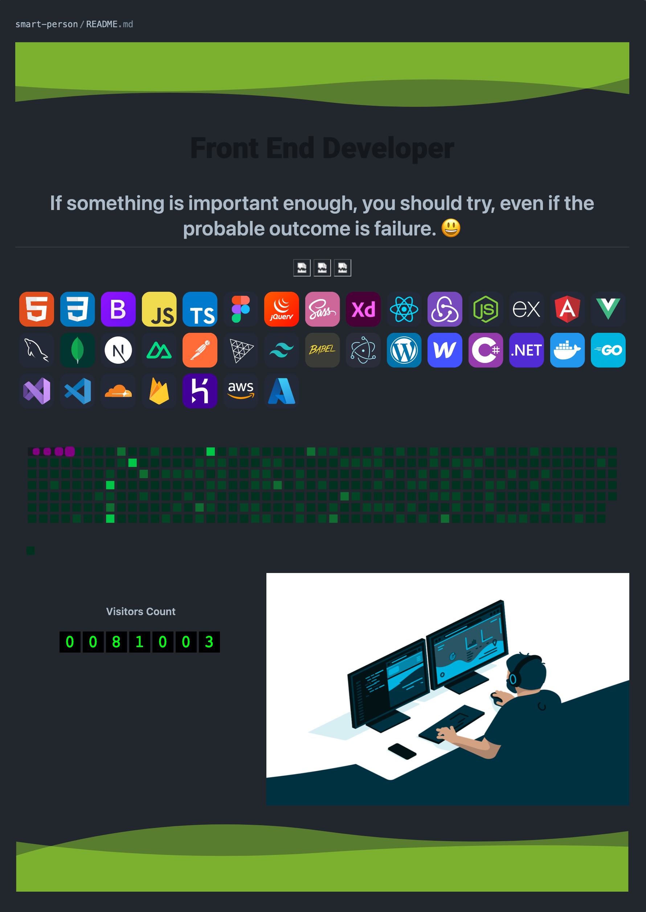

<div align="center">

## Profile README Demo.
</div>

[//]: # ( Screenshot Demo ⬇️ )
<div align="center">
<a href="https://Github.com/smart-person#README">

</a>
</div>

<div align="center">

## Source Code:
</div>

[//]: # ( README.md Source Code ⬇️ )
```html

<div align="center" >

    

    [](https://git.io/typing-svg)

    <div>

        <h1 align="center">
            If something is important enough, you should try, even if the probable outcome is failure. 😃️
        </h1>

    </div>
    <div style="display: flex; flex-wrap: wrap; justify-content: center; align-items: center;">
        
        
        

    </div>

    </details>

    </a>
    </p>
    <p align="center">
        <a href="https://skillicons.dev">
            

        </a>
    </p>
    

    <p align="center">
        
    </p></td></tr></table>

    

</div><br>

<div align="center">
    <br><p align="centre"><b>Visitors Count</b></p>
    <p align="center"></p>

    

```

<div align="center">

## Created by: smart-person
</div>

[//]: # ( Creator Profile ⬇️)
<div align="center">
<a href="https://Github.com/smart-person#README">

</a>
</div>

